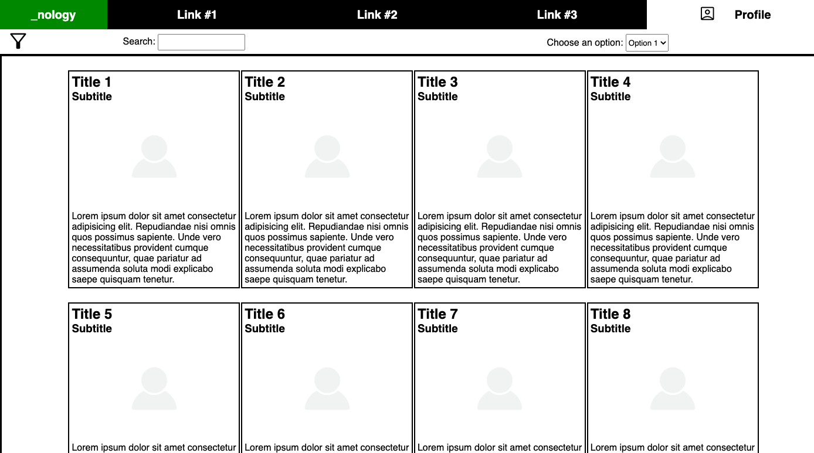

# Flexbox Challenge

## Description

This project highlights the more advanced CSS lessons we completed. It includes the use of semantic and non-semantic HTML, classes and id's, flexbox, icons, and psuedo classes.

